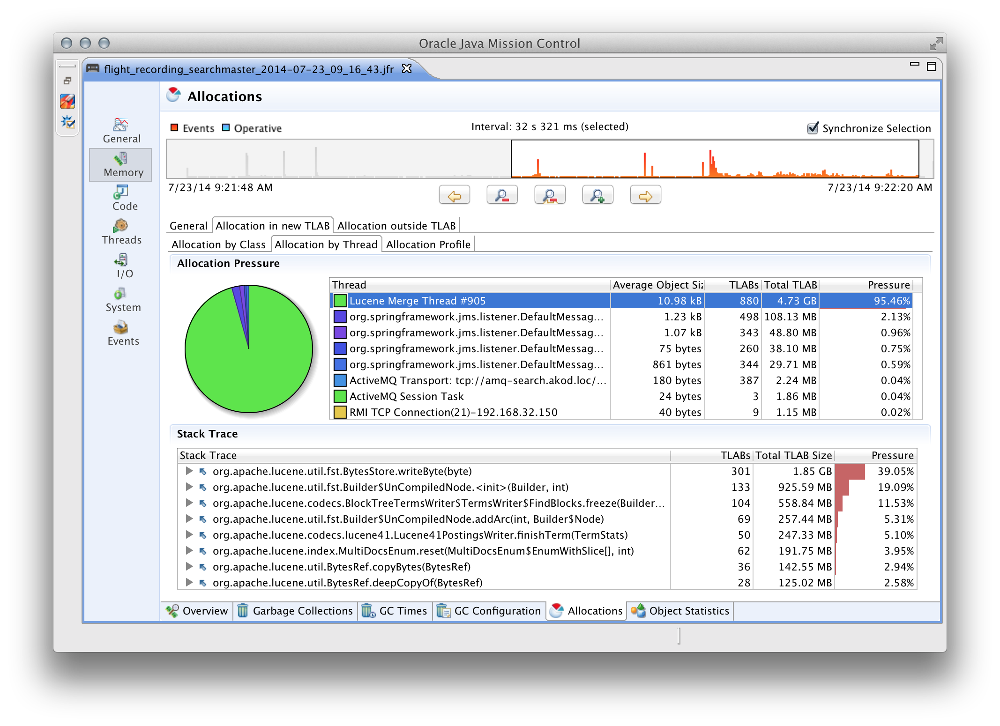
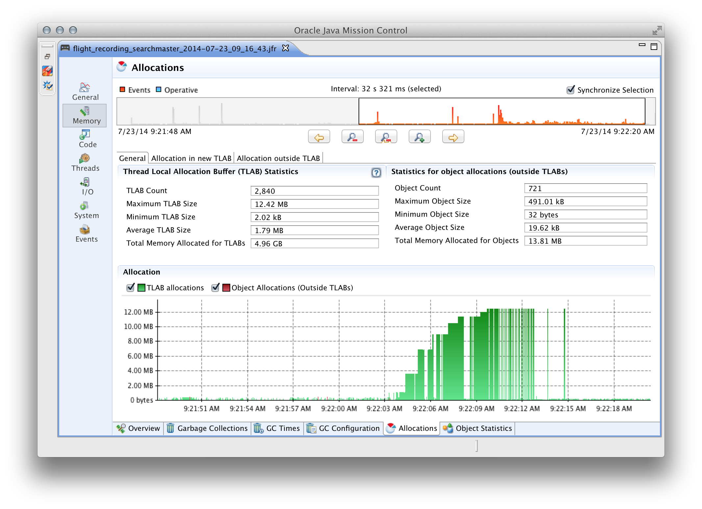
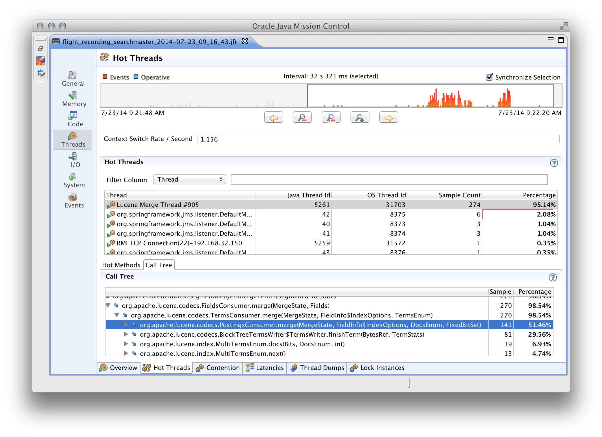

#Новые особенности в языке Java 8
[часть 1](http://info.javarush.ru/translation/2014/10/09/Особенности-Java-8-максимальное-руководство-часть-1-.html) **|** [часть 2](http://info.javarush.ru/translation/2014/10/09/Особенности-Java-8-максимальное-руководство-часть-2-.html)
> Главным улучшением в Java 8 является добавление поддержки функциональных программных конструкций к его объектно-ориентированной основе.

###Методы по умолчанию
1.1 default-методы (виртуальные методы расширения)
1.2 Ромбовидное наследование
1.3 Наследование интерфейсов с методами по умолчанию
* [Презентация java 8 (biplane).pdf](https://github.com/Home-Java8/Java8/blob/master/Презентация%20java%208%20(biplane).pdf)
---
    Default методы определяются в интерфейсе и могут иметь реализацию;
    Если в супер классе существует переопределение default-метода - тогда компилятор выбирает эту реализацию;
    Если один из интерфейсов наследуется от второго интерфейса и переопределяет default-метод - тогда компилятор выбирает наиболее спецефическую реализацию;
    Если существует несколько реализаций для default-метода и невозможно определить наиболее спецефическую из них - тогда необходимо явно переопределить этот default-метод;

###Optional
2.0 Класс Optional

###Лямбда выражения
3.1 Лямбды и Функциональные интерфейсы
3.2 Интерфейсы по умолчанию и статические методы.
3.3 Ссылочные методы
* [Лямбда-выражения в Java 8](https://habrahabr.ru/post/224593/)

###Stream API
4.0 Потоки: Stream API (java.util.stream)

###Параллелизм
5.1 Параллельные массивы.
5.2 Параллелизм (java.util.concurrent)

###API даты/времени
6.0 API для даты/времени (JSR 310)

###Base64
7.0 Base64

###Aннотации
( 8.1 Повторяющиеся аннотации )
( 8.2 Улучшенное выведение типов )
( 8.3 Расширенная поддержка аннотаций )

###Nashorn
( 9.0 Движок Nashorn JavaScript )

#Top 10 фич Java 8

[bazhenov.me/blog/2014/07/20/java-8-top10.html](http://bazhenov.me/blog/2014/07/20/java-8-top10.html)

